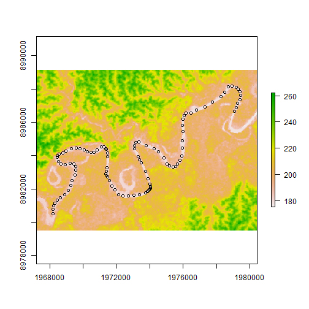
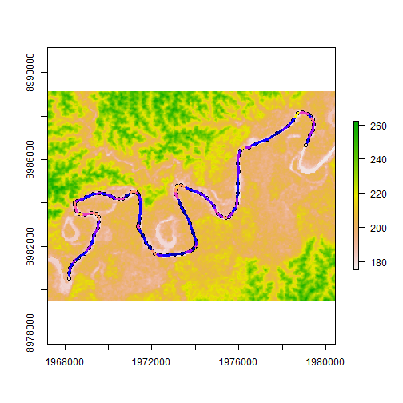
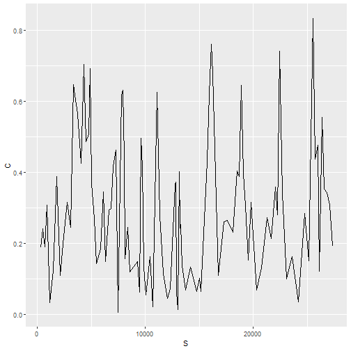

Let us consider points (loaded from a shapefile) and a DEM (loaded from a .tif file)


```r
points=st_read(system.file("data/points.shp", package="morphRiver"))
```

```
## Reading layer `points' from data source `C:\Users\lvaudor\Documents\R\win-library\3.5\morphRiver\data\points.shp' using driver `ESRI Shapefile'
## Simple feature collection with 101 features and 1 field
## geometry type:  POINT
## dimension:      XY
## bbox:           xmin: 1968189 ymin: 8980512 xmax: 1979458 ymax: 8988157
## epsg (SRID):    NA
## proj4string:    +proj=merc +lon_0=-43 +lat_ts=-2 +x_0=5000000 +y_0=10000000 +ellps=GRS80 +units=m +no_defs
```

```r
rasterDEM=raster(system.file("data/rasterDEM.tif", package="morphRiver"))
```

Here is a view of the data in these files


```r
plot(rasterDEM)
plot(points,
     add=TRUE, col=1)
```




```r
plot(rasterDEM)
plot(points,
     add=TRUE, col=1)
rcurv=curvature(points) %>% points_to_linestring()
plot(rcurv["C"],
    add=TRUE, lwd=3)
```




# Curvature as longitudinal signal


```r
library(ggplot2)
ggplot(data=rcurv, aes(x=S,y=C))+
  geom_path()
```



